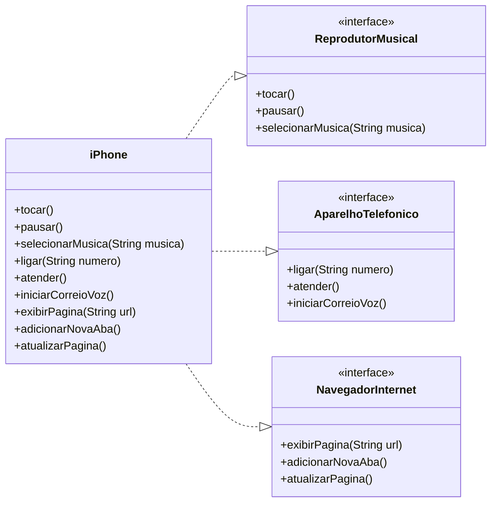

# POO - Desafio: Modelagem e Diagramação de um Componente iPhone
### Contexto do desafio:
Este projeto tem como objetivo modelar e implementar as funcionalidades do componente iPhone, baseando-se no famoso vídeo de lançamento de 2007, onde Steve Jobs o apresenta como a união de três dispositivos em um só: um reprodutor musical, um aparelho telefônico e um navegador de internet.

#### Referência do desafio : [Lançamento iPhone 2007](https://www.youtube.com/watch?v=9ou608QQRq8) 

### Objetivo
Criar um diagrama UML que represente as interfaces para cada funcionalidade (`ReprodutorMusical`, `AparelhoTelefônico`, `NavegadorInternet`) e uma classe iPhone que implemente todas elas.

## Diagrama UML (Mermaid)

O diagrama de classes a seguir ilustra a solução proposta, utilizando interfaces para definir o "contrato" de cada funcionalidade e a classe `iPhone` para centralizar a implementação de todas elas.

#### Criado na sintaxe [Mermaid](https://mermaid.js.org/) seguindo desafio do curso.

#### Esse é mais um desafio proposto pela DIO trilha java básico, vencido por João Cruz ☕

# POO - Desafio: Modelagem e Diagramação de um Componente iPhone
### Contexto do desafio:
Este projeto tem como objetivo modelar e implementar as funcionalidades do componente iPhone, baseando-se no famoso vídeo de lançamento de 2007, onde Steve Jobs o apresenta como a união de três dispositivos em um só: um reprodutor musical, um aparelho telefônico e um navegador de internet.

#### Referência do desafio : [Lançamento iPhone 2007](https://www.youtube.com/watch?v=9ou608QQRq8) 

### Objetivo
Criar um diagrama UML que represente as interfaces para cada funcionalidade (`ReprodutorMusical`, `AparelhoTelefônico`, `NavegadorInternet`) e uma classe iPhone que implemente todas elas.

## Diagrama UML (Mermaid)

O diagrama de classes a seguir ilustra a solução proposta, utilizando interfaces para definir o "contrato" de cada funcionalidade e a classe `iPhone` para centralizar a implementação de todas elas.

#### Criado na sintaxe [Mermaid](https://mermaid.js.org/) seguindo desafio do curso.

#### Esse é mais um desafio proposto pela DIO trilha java básico, vencido por João Cruz ☕

